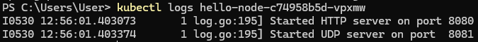
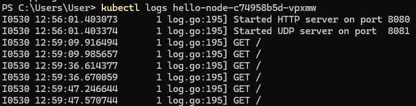
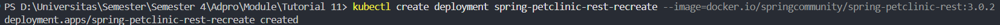
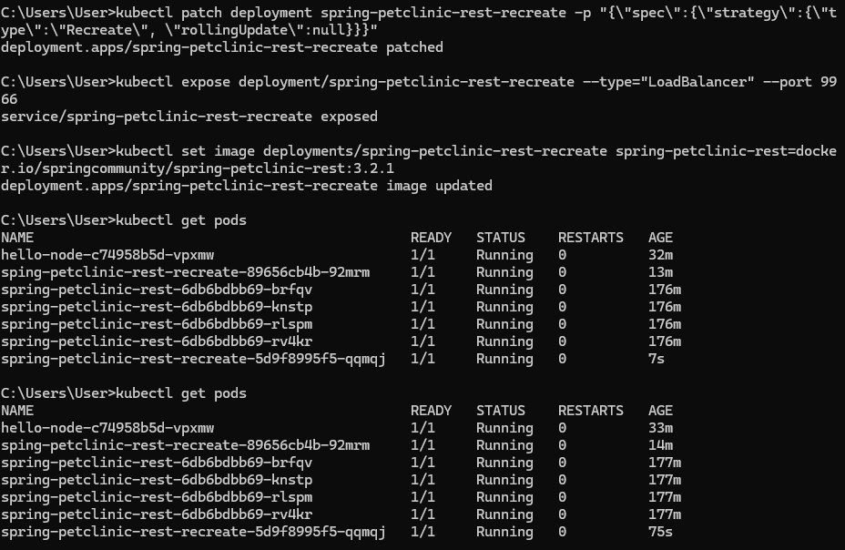
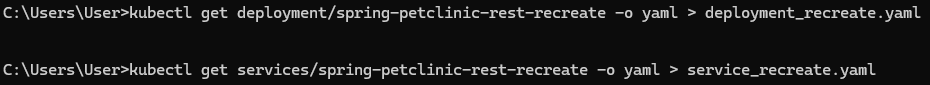

# Reflection on Hello Minikube

## 1.  Compare the application logs before and after you exposed it as a Service.
Try to open the app several times while the proxy into the Service is running.
What do you see in the logs? Does the number of logs increase each time you open the app?

### Before Expose

### After Expose

### Penjelasan
- Jumlah log bertambah karena app dibuka dan setiap kali app dibuka maka request disimpan ke logs pod

## 2. Notice that there are two versions of `kubectl get` invocation during this tutorial section. The first does not have any option, while the latter has `-n` option with value set to `kube-system`. What is the purpose of the `-n` option and why did the output not list the pods/services that you explicitly created?

- Opsi `-n` (atau `--namespace`) pada perintah `kubectl get` digunakan untuk menentukan namespace tertentu sebagai target eksekusi perintah. Jika opsi ini tidak digunakan, maka `kubectl` secara otomatis akan menggunakan namespace default, tempat di mana pod atau service seperti `hello-node` biasanya dibuat. Namespace seperti `kube-system` diperuntukkan bagi komponen inti Kubernetes, sehingga saat menjalankan `kubectl get pods -n kube-system`, yang ditampilkan hanyalah pod-pod sistem Kubernetes, bukan aplikasi yang berjalan di namespace default atau namespace lainnya.

# Reflection on Rolling Update & Kubernetes Manifest File

## 1.  What is the difference between Rolling Update and Recreate deployment strategy?

- Kalau Strategi **Recreate** mematikan semua pod versi lama terlebih dulu, lalu membuat pod versi baru. Cara ini sederhana dan memastikan hanya satu versi aplikasi yang aktif, tetapi menimbulkan downtime selama perpindahan.
Sebaliknya, **Rolling Update** (pengaturan default) mengganti pod lama secara bertahap dengan pod baru. Selama fase ini dua versi aplikasi berjalan berdampingan, sehingga layanan tetap tersedia, downtime dipangkas atau hilang sama sekali, dan rollback dapat dilakukan dengan lebih aman—meski strategi ini butuh sumber daya ekstra.

## 2. Try deploying the Spring Petclinic REST using Recreate deployment strategy and document your attempt.
- 
- 

## 3. Prepare different manifest files for executing Recreate deployment strategy.
- 

## 4. What do you think are the benefits of using Kubernetes manifest files? Recall your experience in deploying the app manually and compare it to your experience when deploying the same app by applying the manifest files (i.e., invoking `kubectl apply -f` command) to the cluster.

- untuk file manifes seperti YAML dalam Kubernetes menawarkan efisiensi tinggi dibandingkan konfigurasi manual melalui perintah kubectl satu per satu. Lewat manifes, seluruh kebutuhan aplikasi—mulai dari container image, jumlah instance, hingga pengaturan jaringan—dideklarasikan secara eksplisit. File ini dapat diarsipkan dalam sistem version control seperti Git, memungkinkan jejak perubahan yang transparan, kemudahan rollback saat terjadi error, serta audit yang lebih mudah. Keunggulan lainnya adalah konsistensi: konfigurasi yang sama bisa diterapkan di berbagai lingkungan—seperti development, staging, atau production—dengan hasil seragam. Perintah `kubectl apply -f deployment.yaml` juga bersifat idempoten, hanya menerapkan perubahan bila ada ketidaksesuaian dengan kondisi aktual cluster. Dengan cara ini, pengelolaan dan pembaruan aplikasi menjadi lebih sistematis dan dapat diandalkan, jauh melebihi pendekatan manual yang cenderung tidak konsisten dan sulit dilacak.

